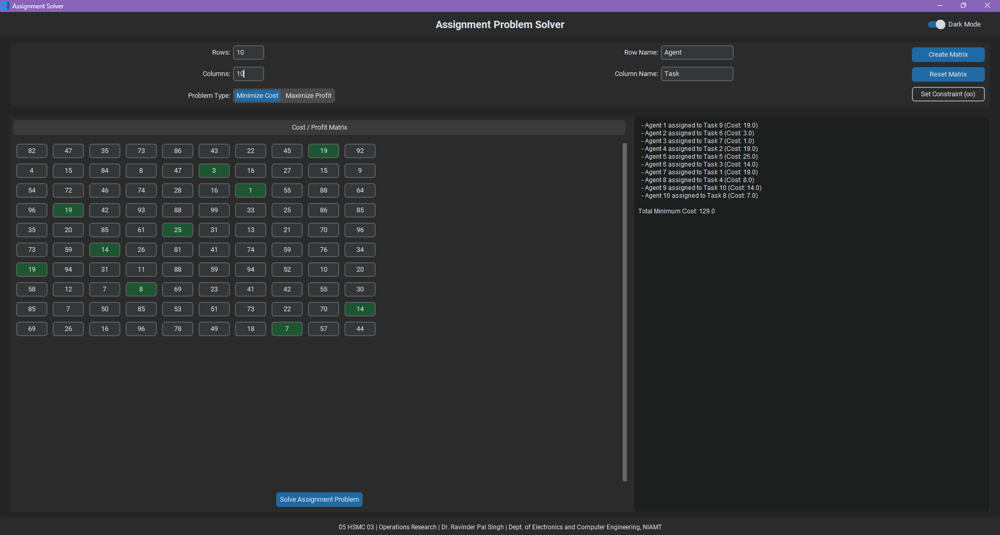

# Assignment Problem Solver

A desktop application for solving the **assignment problem**, a fundamental topic in Operations Research. This tool efficiently computes the optimal one-to-one assignment of agents to tasks—either to **minimize total cost** or **maximize total profit**.

Built using **Python** and **CustomTkinter**, this application features a clean, modern, and user-friendly interface tailored for students, educators, and professionals tackling optimization problems.

---

## 🔧 Features

- **Dual Problem Modes**  
  Solve both **Minimization** (e.g., minimizing cost) and **Maximization** (e.g., maximizing profit) problems.

- **Dynamic Matrix Creation**  
  Specify any number of agents and tasks to generate a flexible cost/profit matrix.

- **Random Matrix Generation**  
  Quickly populate the matrix with random integers for easy testing and demos.

- **Constraint Handling**  
  Mark impossible assignments as **infinity (`inf`)** with a single click.

- **Interactive Highlighting**  
  Optimal assignments are auto-highlighted in **green** after solving, for instant visual feedback.

- **Scrollable Matrix Grid**  
  Easily handle large-scale problems with a fully scrollable interface.

- **Modern UI**

  - Clean, two-column layout
  - Light and Dark Mode toggle
  - Real-time feedback on operations (e.g., _"Solving..."_)

- **Custom Labels**  
  Rename "Agent" and "Task" to domain-specific terms (e.g., "Wagons" and "Stations").

---

Technologies Used

    Language: Python

    GUI Framework: CustomTkinter

    Numerical Operations: NumPy
